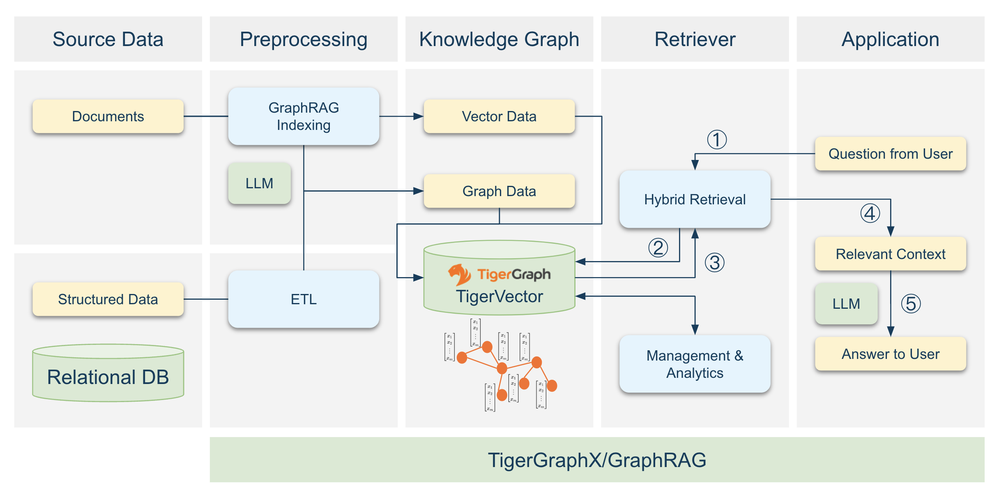

# GraphRAG Overview

## What is GraphRAG?

**GraphRAG (Graph-Retrieval Augmented Generation)** is a cutting-edge workflow that combines the strengths of graph databases and retrieval-augmented generation (RAG). By leveraging graph structures, semantic relationships, and vector embeddings, GraphRAG enhances the contextual understanding and response generation of large language models (LLMs).

GraphRAG empowers applications with:

- **Contextual Retrieval**: Combining graph traversals with semantic and vector-based searches for precise context.

- **Scalability**: Supporting large-scale knowledge graphs and real-time data processing.

- **Explainability**: Allowing insights into the relationships and structures behind generated responses.

---

## How Does TigerGraph Support GraphRAG?



TigerGraph is uniquely equipped to enable GraphRAG workflows by providing:

- **Graph-Structured Data**: Powerful graph modeling with schema-defined nodes and edges.

- **Hybrid Retrieval**: Seamless integration of graph traversal, semantic search, and vector retrieval.

- **High-Performance Queries**: Real-time execution of complex multi-hop queries and hybrid retrieval tasks.

For more details on TigerGraph's specific capabilities, see [Why TigerGraph](why_tigergraph.md).

---

## Two Options for Implementing GraphRAG with TigerGraph

TigerGraph offers flexibility in how you implement GraphRAG workflows, with two distinct approaches tailored to different developer preferences:

### **1. GSQL (Graph Query Language)**
- **Ideal for**: Advanced users who require full control over query logic.
- **Key Features**:
  - Write custom GSQL queries for complex hybrid retrieval and multi-hop graph traversals.
  - Integrate vector embeddings directly into graph queries for hybrid search.

#### Example GSQL Query
```gsql
CREATE OR REPLACE QUERY query (List<float> embedding, int k) {
  Nodes = TopKVectorSearch({Entity.entity_embedding}, embedding, k);

  Neighbors =
    SELECT t
    FROM Nodes:s -(relationship:e)- :t;

  PRINT Neighbors;
}
```

---

### **2. Python-Native TigerGraphX**
- **Ideal for**: Python developers looking for an intuitive, high-level interface.
- **Key Features**:
  - Programmatically define graph schemas and load data.
  - Use Python-native APIs to perform hybrid retrieval without writing GSQL.
  - Simplify complex workflows with a developer-friendly approach.

#### Example TigerGraphX Workflow
```python
from tigergraphx import Graph

# Define schema
schema = {
    "vertices": {"Entity": {"primary_key": "id", "attributes": {"id": "string"}}},
    "edges": {"Relationship": {"from_node_type": "Entity", "to_node_type": "Entity"}}
}

# Initialize the graph
graph = Graph(schema)

# Perform hybrid retrieval
query_embedding = [0.1, 0.2, 0.3]  # Example embedding vector
top_k_objects = graph.retrieve_top_k_objects(query_embedding, k=5)
neighbors = graph.get_neighbors(vertex_id=top_k_objects[0]["id"], depth=2)

print("Top-K Objects:", top_k_objects)
print("Neighbors:", neighbors)
```

---

## TigerGraphX and GraphRAG Workflows

While GSQL provides complete control, **TigerGraphX** offers a Python-native interface that makes it easier to:
- Define schemas and load data programmatically.
- Perform hybrid retrieval with minimal learning curve.
- Build token-aware context for LLMs in a seamless, developer-friendly way.

Explore practical implementations of GraphRAG with TigerGraph in the [Microsoft GraphRAG](msft_graphrag.md) section.

---

## Next Steps

1. Understand why TigerGraph is ideal for GraphRAG in [Why TigerGraph](why_tigergraph.md).
2. Explore a practical use case in [Microsoft GraphRAG](msft_graphrag.md).

---

Start unlocking the power of graphs with **TigerGraphX** today!
